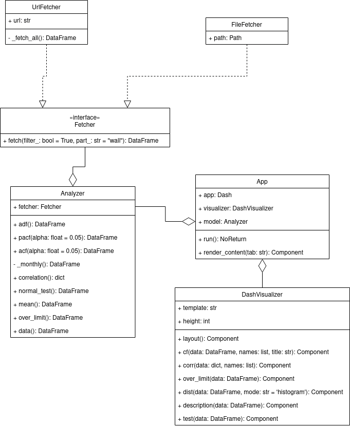

## Статистические тесты

* Тест Шапиро-Уилка для проверки гипотезы о нормальности распределения
* Расширенный тест Дики-Фуллера для проверки гипотезы о стационарности временного ряда
* Коэффициент корреляции Пирсона со скользящим окном для проверки зависимости временных рядов

## Архитектура

